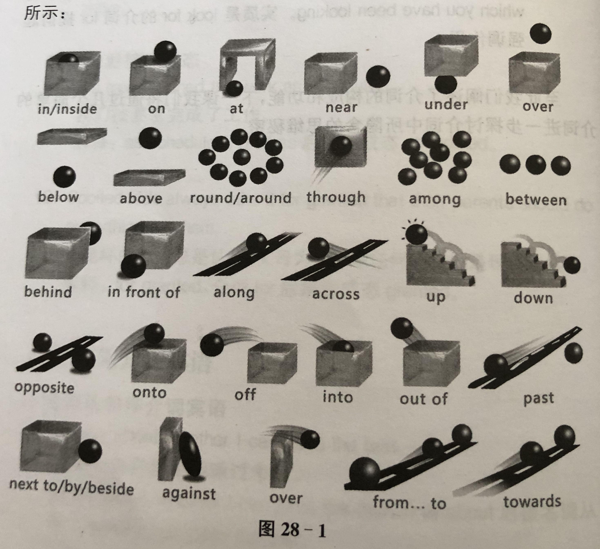

## 英语的时态体系
—— 《英语思维-解密英语语法的原理》

##### “时”和“态”的概念
为什么会有时态的概念？
* 在英语的句型体系中，最终都是要落地于五大基本句型。五大句型中都包含谓语成分。这说明什么呢？
* 谓语(动词)很重要。 考虑实际情况中，动作/状态的执行/持续是有 “时” 和 “态” 的概念的，两个都指明并表达清楚才是准确严谨的表达。

##### “时” —— 时间节点(“态”的起点)
过去、 现在、将来、过去某个点的过去、过去某个点的将来。

##### “态” —— 持续时间(持续性的类别)
不定时态、进行时态、完成进行时态、完成时态、一般态瞬态、一般态常态。

怎么解释呢，如果学习过运动建模，那么就知道一个运动可以由一个点加上一个向量来准确表达。可以类比对应此处时和态的概念。

### Part 1 —— 时态体系

#### 1.1 时态体系的基本成分

##### 时间轴


##### 动作的四种态
* 不定式，即不定态。 （表示动作要开始）
* 进行态。 （表示动作的进行中）
* 完成态。 （表示动作已完成）
* 一般态。 （更侧重于强调动作本身，并弱化掉要做、进行中、已完成的表达）

例如吃饭这件事儿，从执行上是要分为：要去吃、正在吃、已吃完。但是，我们会不会有那么一个点，不是去执行，而只是提吃饭这件事儿？这就是一般态对应的场景。不是去干，我就是说说。

###### 此处有惊喜：非谓语动词的另一种解释（从功能用途上）
```
知道了动作的四种态，现在知道关于动作，在聊天时可以聊：
我要去吃、我正在吃、我已吃完、我就是说说吃这事儿。
那么，这动作的四种态都不是从谓语的功能出发的，而是表达动作的执行或者就是说说动作这回事儿
# 动作的四态，即动词的四种非谓语用途。 就是非谓语动词的由来。
```

现在，考虑组合一下动作的四态和时。

|   /   | 过去 | 现在  | 将来  | 过去某个点的将来 |
| ----  | ---- | ---- | ---- | ---- |
| 不定态 |      |      |      |      |
| 进行态 |      |      |      |      |
| 完成态 |      |      |      |      |
| 一般态 |      |      |      |      |

至此，时态体系的基本成分已经掌握，缺少了一个英语独有的 完成进行态。

#### 总结： 时态体系 = 5 态 + 4 时。 另外，5 态是 4+1。

###### 补充： 完成进行态
```
动词的三个态：不定态、进行态、完成态 可以两两结合，甚至是全部结合在一起。
另外，如果你想，那么任意的态还可以与两个以上的时进行结合。。（就是可以这么复杂和超现实）
# 动作有四态，分别表示： 要做、做的过程中、已做过、一般态。 可以从两个角度分析：执行、说说。
# 逻辑上已覆盖完全，为什么还会有完成进行态？什么目的？
# 强调！ 看到完成进行态，不要纠结于完成了还怎么在执行中，把 “完成” 二字 看作 “强调”。
因此，完成进行态，比进行态增加了强调的特点。 含义是：动作的执行持续期太长了；或者是一个动作反反复复的执行。
（此处需要提一下，从执行角度，完成进行态有 often do 的意思；那么，何时用 often do 的表达？当然是说说的角度。）
```
###### 补充：过去将来时
```
一般我们聊天，都是基于现在。所以，过去时、现在时、将来时 很好理解。
# 那么，什么时候才会出现过去将来时？
# 当然是有一个过去的参照节点时。
# 因此，句子中必然有其他成分，并且充当过去这个参考节点。
现在知道了，为什么学习“态”时，参考节点这个句子成分往往被学习者被忽略吧？
没有参考节点就是以现在为参考，就没有其他成分。
```

#### 1.2 
—— 现在聊聊说话这件事儿

前面讲到，动作有4种态，在聊天功能上，引出四种非谓语动词。说话这件事儿，别忘了还有假如我怎样这种。因此，与动词相关的就有以下三种情况：
* 一般情况。 （动作的执行，主动/被动）
* 非谓语动词的情况。
* 虚拟语气。

#### 总结： 除了时态成分，还有三种场景要分别独立考虑。

### Part 2 —— 一般场景下的动词时态
5 种态 x 4 种时 = 20 种时态。

### Part 3 —— 非谓语动词的时态
4 种态(一般、进行态、完成态、完成进行态) 

注意，非谓语动词没有时的概念。

### Part 4 —— 虚拟语气下的动词时态
在讨论虚拟语气之前，思考什么是条件句？
* 条件句，就是基于预设的条件，得出预设的结果。

条件有真假之分，真假又有什么区别？
* 条件是真的，那就是如现实发生的或正在发生的事，正常。 （真实条件句）
* 条件是假的，即想要啥没有，所以就是假想的，虚拟语气。（非真实条件句，即虚拟语气）

###### 补充： 什么是条件句？
```
# 条件句，顾名思义就是假设句。 而假设有两个出发点： 1. 意淫； 2. 后悔。
# 第一个出发点，对应 真实条件句（第一条件句）： If ..., ... will ...
  ● If .. is/are/do/v ., .. will ...
# 第二个出发点，对应 非真实条件句（虚拟语气）： If 引导的假设 使用过去时。
  ● If .. were/-ed .., .. would ...
    注意： 如果本身肆意的事情就是 过去式， 则非真实条件句的形式为 ：
    If + had + 过去分词， .. should/would have + 过去分词。
```

###### 补充： 条件句的引导词
```
只有两个： if 和 when。
if 引导的条件句，发生概率低一些。
when 引导的条件句，发生的频率高。
```

既然条件句的定义很清晰，为什么要专门创造一个虚拟语气的概念？
* 考虑主句和条件从句成为事实的**可能性**。

虚拟语气的概念是为了获得一个语法上的约定： 使用动词的“过去形”表达小的可能性；用动词的“现在形”表达大的可能性。 （当然，虚拟语气都是用的“过去形”）

#### 4.1 虚拟语气下的动词时态（难点）
5 种态 x 3 种时(过去、现在、将来) = 15 种时态。

**注意，由于是虚拟语气，所以动词一定要是“过去形”。** 原因为何请看前面介绍内容。（真实条件句和虚拟语气的动词时态让人头大。）

#### 4.2 虚拟语气的其他应用
* 用 wish 表达虚拟语气
* 用 it is time 表达虚拟语气
* 从句中的虚拟语气。
* 表示请求中的虚拟语气。

### Part 5 —— 助动词的秘密
助动词，即协助主动词实现谓语功能。

由于谓语分时和态，因此，助动词也根据时态发生变化：

|  /   | 过去  | 现在 | 将来 | 过去将来 |
| ---- | ---- | ---- | ---- | ---- |
| 一般态 | did | do/does | will | would |
| 不定态 | was/were | am/is/are | will be | would be |
| 进行态 | was/were | am/is/are | will be | would be |
| 完成态 | had | have | will have | would have |
| 完成进行态 | had | have | will have | would have |

<br>

## 英语思维

#### 1. not 和 no 的不同
no 主要对句子整体进行否定，not 对句子成分进行否定。 no 的否定范围大于 not。

#### 2. 认识介词
英语功力深不深厚，看介词的使用。 介词，是用于描述事物对其所处时空关系。

#### 3. 介词的思维
<div align="center"></div>

#### 4. 数字的思维
* 单位
    * 百位 hundred
    * 千位 thousand
    * 百万位 million
    * 十亿位 billion
    * 万亿位 trillion
* 表达
    * 百以内 one ~ ninety-nine
    * 百位 one hundred ~ nine hundred
    * 千位 one thousand ~ nine hundred ninety-nine thousand
    * 百万位 one million ~ nine hundred ninety-nine million
    * 十亿位 one billion ~ nine hundred ninety-nine billion

#### 5. 时间表达的思维
* to 和 pass 分别表示，在基准时间前、后。

#### 6. will 和 would 的思想内涵
* will 表达将来，其思想内涵是几乎势在必行。
* 代表过去将来时间的 would，其思想内涵是可能执行。

(同理，适用于 can 和 could, shall 和 should, may 和 might。)

#### 7. 疑问句
* 一般疑问句
* 特殊疑问句
