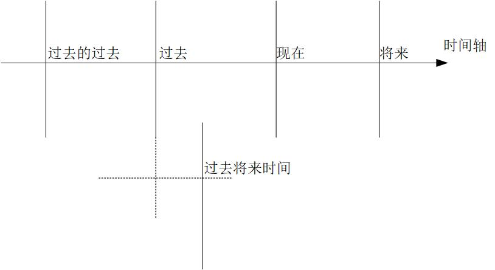

## 英语的时态体系
—— 《英语思维-解密英语语法的原理》

##### “时”和“态”的概念
为什么会有时态的概念？
* 在英语的句型体系中，最终都是要落地于五大基本句型。五大句型中都包含谓语成分。这说明什么呢？
* 谓语(动词)很重要。 考虑实际情况中，动作/状态的执行/持续是有 “时” 和 “态” 的概念的，两个都指明并表达清楚才是准确严谨的表达。

##### “时” —— 时间节点(“态”的起点)
过去、 现在、将来、过去某个点的过去、过去某个点的将来。

##### “态” —— 持续时间(持续性的类别)
不定时态、进行时态、完成进行时态、完成时态、一般态瞬态、一般态常态。

怎么解释呢，如果学习过运动建模，那么就知道一个运动可以由一个点加上一个向量来准确表达。可以类比对应此处时和态的概念。

### Part 1 —— 时态体系

#### 1.1 时态体系的基本成分

##### 时间轴


##### 动作的四种态
* 不定式，即不定态。 （表示动作要开始）
* 进行态。 （表示动作的进行中）
* 完成态。 （表示动作已完成）
* 一般态。 （更侧重于强调动作本身，并弱化掉要做、进行中、已完成的表达）

例如吃饭这件事儿，从执行上是要分为：要去吃、正在吃、已吃完。但是，我们会不会有那么一个点，不是去执行，而只是提吃饭这件事儿？这就是一般态对应的场景。不是去干，我就是说说。

###### 此处有惊喜：非谓语动词的另一种解释（从功能用途上）
```
知道了动作的四种态，现在知道关于动作，在聊天时可以聊：
我要去吃、我正在吃、我已吃完、我就是说说吃这事儿。
那么，这动作的四种态都不是从谓语的功能出发的，而是表达动作的执行或者就是说说动作这回事儿
# 动作的四态，即动词的四种非谓语用途。 就是非谓语动词的由来。
```

现在，考虑组合一下动作的四态和时。

|   /   | 过去 | 现在  | 将来  | 过去某个点的将来 |
| ----  | ---- | ---- | ---- | ---- |
| 不定态 |      |      |      |      |
| 进行态 |      |      |      |      |
| 完成态 |      |      |      |      |
| 一般态 |      |      |      |      |

至此，时态体系的基本成分已经掌握，缺少了一个英语独有的 完成进行态。

#### 总结： 时态体系 = 5 态 + 4 时。 另外，5 态是 4+1。

#### 1.2 
—— 现在聊聊说话这件事儿

前面讲到，动作有4种态，在聊天功能上，引出四种非谓语动词。说话这件事儿，别忘了还有假如我怎样这种。因此，与动词相关的就有以下三种情况：
* 一般情况。 （动作的执行，主动/被动）
* 非谓语动词的情况。
* 虚拟语气。

#### 总结： 除了时态成分，还有三种场景要分别独立考虑。

### Part 2 —— 一般场景下的动词时态

### Part 3 —— 非谓语动词的时态

### Part 4 —— 虚拟语气下的动词时态

<br>

## 英语思维

#### 1. not 和 no 的不同

#### 2. 认识介词

#### 3. 介词的思维

#### 4. 数字的思维

#### 5. 时间表达的思维
